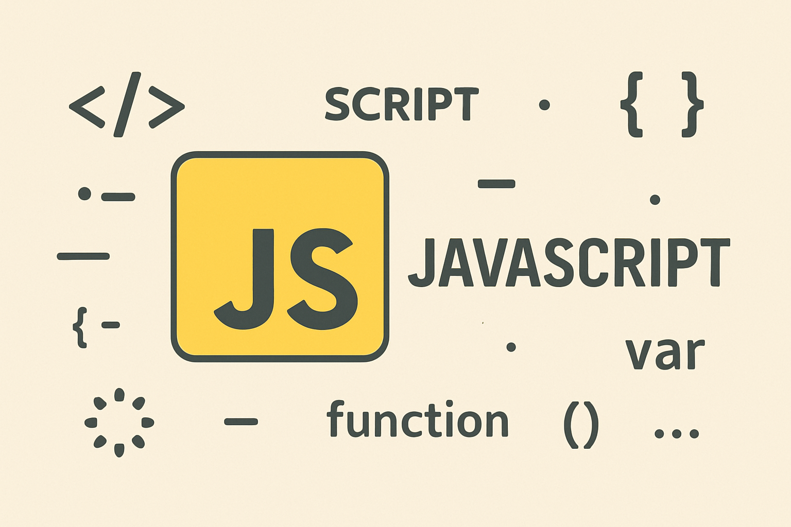

## Introducción


### Hola mundo 

Para buenas practicas al momento de crear directorios/archivos en JavaScript existe algo a lo que se le conoce como **Kebab Case**, y lo cual consiste en **separar los nombres de los archivos por guiones medios**, también existe algo otra practica llamada **Snake Case**, la cual consiste en **separar los nombres de archivos por guiones bajos**, pero por buenas practicas debemos usar Kebab Case.

#### Impresión de Hola Mundo en JS

```js
console.log("Hola Mundo!");
```

- `console`: Objeto para interactuar con la consola
- `log`: Función/operación para escribir algo por al consola
- `("Hola Mundo!")`: Parametros

En JS el **punto y coma es opcional**.

#### Comentarios en JS

Para hacer un comentario de una sola linea, debemos hacer lo siguiente:

```JS
// Comentario de una sola liena 
```

Para un comentario de multiples lineas:

```JS
/*
Un comentario
de varias 
lineas
*/
```


#### Variables

En JS **existen tres maneras** clave de **crear variables**, usando las palabras reservadas **var**, **let** y **const**, y cada una cumple con ciertos objetivos.

Ahora, para crear variables, **los nombres** de las **variables deben ser descriptivos** y como buena practica lo debemos de crear **usando el camel case** (indica que, la **primera palabra debe comenzar con una letra minúscula**)

> Ejemplo de una variable

```JS
var holaMundo = "Hola JavaScript";
```

> [!NOTA]
> Hoy en día, esta es la manera en como **NO debemos declarar una variable en JavaScript**, por la simple y sencilla razón de que no es una buena practica usar **var** para declarar nuestras variables.


#### Diferencias entre var, let y const

1. var
- Es viejo y casi **no se usa actualmente**.
- Las variables **pueden cambiarse**.
- **Vive en toda la función**, aunque la declares dentro de una clase o un método.
- A veces se comporta de una manera extraña porque **existe antes de que la escribas**.

2. let
- Es más moderno.
- **Las variables se pueden cambiar**.
- Solo **funciona dentro de donde fue declarada** (como una **clase** o un **método**).
- No puede ser usada antes de ser declarada.

3. const
- Es moderno.
- Su valor **no puede ser alterado**.
- **Funciona solo donde fue declarada**.

#### Tipos de datos primitivos en JS

Un valor en JS siempre pertenece a un tipo de dato determinado. **Hay ocho tipos de datos básicos en JS**.

Podemos almacenar un valor de cualquier tipo dentro de una varaiable.

> Ejemplo: Una variable en un momento puede contener nu String y luego un número.

```JS
let message = "Hola";
message = 124;
```

A esto se le llama **lenguajes dinamicamente tipados**.
Lo que significa que las **variables no estan vinculadas rígidamente a ningún tipo de dato**.

#### Tipos de datos 

- **Number**
```js
int n = 1234;
n = 12.43;
```

Representa tanto a los **números enteros** como a los **números de punto decimal** (flotante).

Además, existen los llamados **"valores numéricos especiales"** que igual pertenecen a este tipo:

> **infinity, -infinity y NaN.**

- **_infinity_**: Representa el **infinito matemático**. Es un **valor especial** que es **mayor que cualquier número**.
- **_NaN_**: Representa un **error de calculo**. es el **resultado** de una **operación matemática incorrecta** o idenfinida.

> [!NOTA]
> NaN es **"pegajoso"**. Cualquier otra operación sobre **NaN** devuelve **NaN**.

Por lo tanto, **si hay un NaN en** alguna parte de **una operación matemática** esta **se propaga a todo el resultado**.

